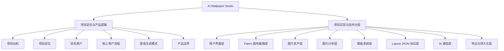
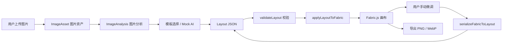
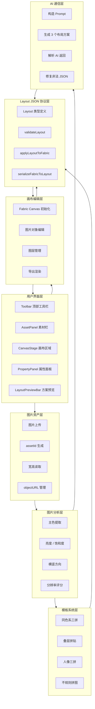
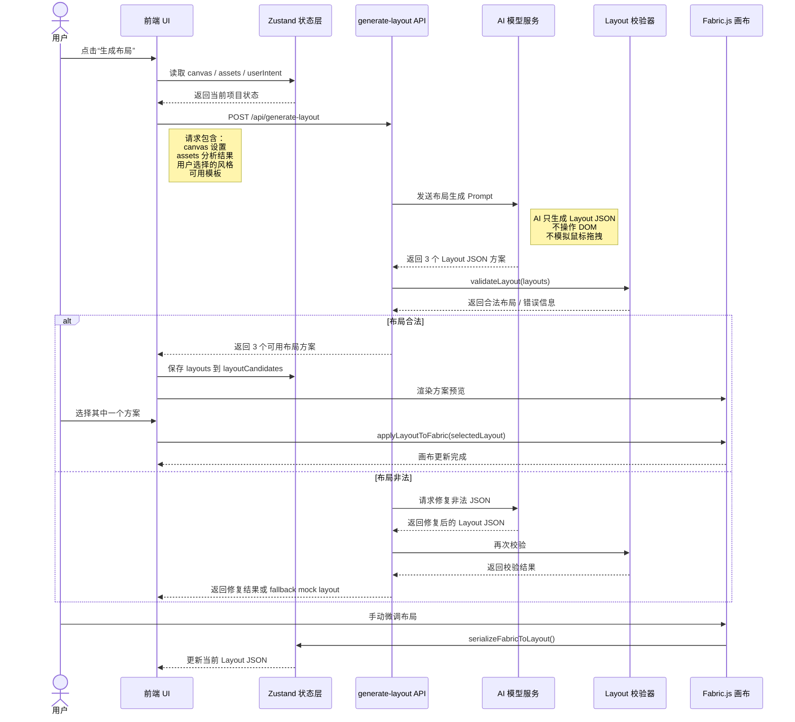
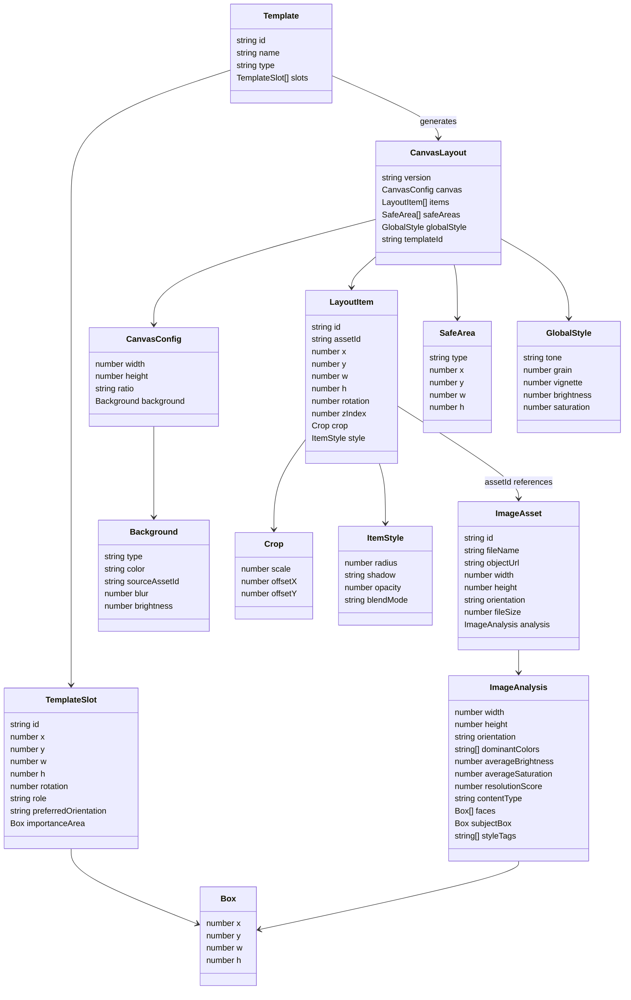
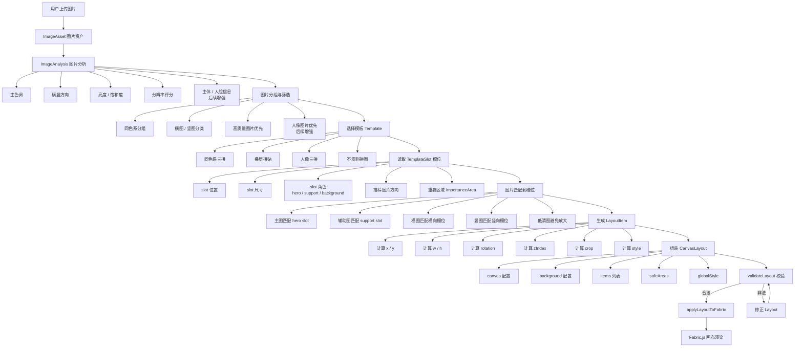
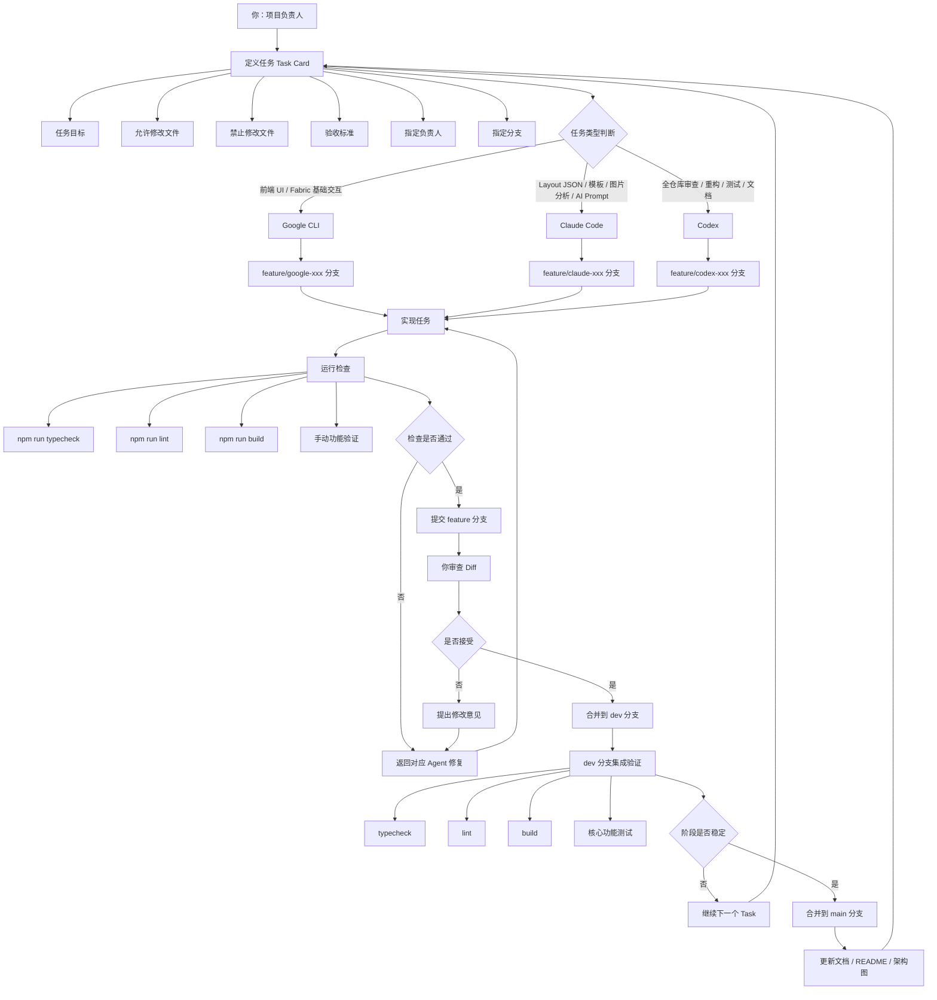
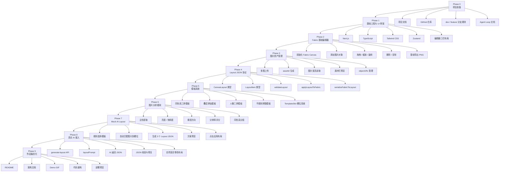

# AI Wallpaper Studio 架构总览文档

> 本文档用于整合 AI Wallpaper Studio 项目的核心架构图、业务流程图、数据模型图、AI 通信流程图、模板生成流程图、Agent 协作流程图与开发路线图。  
> 这些图共同构成项目的产品逻辑、技术分层、数据流转和开发协作体系。

---

## 目录

1. [项目总览图](#1-项目总览图)
2. [核心业务数据流图](#2-核心业务数据流图)
3. [系统分层架构图](#3-系统分层架构图)
4. [AI 布局生成时序图](#4-ai-布局生成时序图)
5. [Layout JSON 数据模型图](#5-layout-json-数据模型图)
6. [模板生成 Layout 流程图](#6-模板生成-layout-流程图)
7. [Agent 协作与 Git 分支流程图](#7-agent-协作与-git-分支流程图)
8. [项目开发阶段路线图](#8-项目开发阶段路线图)
9. [整体架构总结](#9-整体架构总结)

---

# 1. 项目总览图

## 1.1 图的作用

项目总览图用于从最高层理解 AI Wallpaper Studio 的整体结构。

它把项目拆成两大视角：

1. **项目定位与产品逻辑**
2. **项目实现与技术分层**

左侧更偏产品层面，回答：

> 为什么做？给谁用？解决什么问题？用户怎么使用？

右侧更偏技术层面，回答：

> 怎么实现？系统分几层？每层负责什么？模块之间如何协作？

## 1.2 Mermaid 图



## 1.3 说明

这个项目不是普通九宫格拼图工具，也不是单纯的 AI 图片生成器。

它的核心定位是：

> 一个基于 Web Canvas 的 AI 辅助照片壁纸设计工具。

项目的关键不是“把图片拼在一起”，而是：

- 让系统理解用户上传的图片；
- 根据图片色调、比例、主体信息选择合适布局；
- 通过模板和 AI 生成可编辑的 Layout JSON；
- 使用 Fabric.js 渲染成可手动微调的画布；
- 最终导出适合桌面或手机使用的高清壁纸。

项目最重要的设计原则是：

> AI 不直接操作 UI，不模拟鼠标拖拽，而是生成可校验、可编辑、可回写的 Layout JSON。

---

# 2. 核心业务数据流图

## 2.1 图的作用

核心业务数据流图描述用户从上传图片到导出壁纸的完整路径。

它同时表达两个层面：

1. **业务流程**
   - 用户上传图片；
   - 系统生成布局；
   - 用户微调；
   - 用户导出壁纸。

2. **数据流**
   - ImageAsset；
   - ImageAnalysis；
   - Layout JSON；
   - Fabric Canvas；
   - Export。

## 2.2 Mermaid 图



## 2.3 说明

这张图是项目的核心主线。

用户上传图片后，系统不会直接把图片随机拼接到画布上，而是先将图片转换为结构化的 `ImageAsset` 数据。

随后图片分析模块会提取基础特征，例如：

- 图片宽高；
- 横图 / 竖图；
- 主色调；
- 亮度；
- 饱和度；
- 分辨率评分。

这些分析结果会用于模板选择或 AI 布局生成。

模板系统或 AI 生成的不是最终图片，而是 `Layout JSON`。  
`Layout JSON` 会先经过 `validateLayout` 校验，确认坐标、尺寸、层级、图片引用等字段合法，然后再通过 `applyLayoutToFabric` 渲染到 Fabric.js 画布。

用户可以在画布上继续手动调整。  
调整后，系统通过 `serializeFabricToLayout` 将当前画布状态重新转换回 `Layout JSON`，这样 AI 后续仍然可以继续读取和修改当前布局。

这形成了一个完整闭环：

```text
AI 生成 Layout JSON
↓
Fabric 渲染
↓
用户微调
↓
序列化回 Layout JSON
↓
AI 继续修改
```

---

# 3. 系统分层架构图

## 3.1 图的作用

系统分层架构图用于说明项目在技术实现上分成哪些层，每一层负责什么，以及层与层之间如何依赖。

它回答的问题是：

> 这个项目不是一堆功能堆在一起，而是如何通过清晰分层来保持可维护性？

## 3.2 Mermaid 图



## 3.3 说明

项目采用分层架构，而不是把所有逻辑都写在 React 组件中。

各层职责如下：

### 用户界面层

负责展示和交互，例如工具栏、素材栏、画布区域、属性面板和方案预览。

UI 层只负责：

- 展示状态；
- 触发动作；
- 接收用户输入。

它不应该直接包含复杂的 Fabric 操作、AI 调用或 Layout 转换逻辑。

### 画布编辑层

负责 Fabric.js 相关能力，包括：

- 初始化画布；
- 添加图片；
- 拖拽、缩放、旋转；
- 图层管理；
- 导出图片。

这一层不负责决定“布局应该长什么样”，只负责把已有布局渲染出来，并支持用户微调。

### 图片资产层

负责管理用户上传的图片，包括：

- 文件读取；
- assetId 生成；
- objectURL 管理；
- 图片宽高读取；
- 素材栏展示。

### 图片分析层

负责提取图片特征，例如主色、亮度、饱和度、横竖方向和分辨率评分。

这些分析结果会作为模板系统和 AI 布局生成的输入。

### 模板系统层

负责提供稳定布局结构，例如三拼、叠层、人像三拼、不规则拼图。

模板系统输出的是 Layout JSON，而不是直接操作 Fabric。

### Layout JSON 协议层

这是项目的核心数据协议层。

它负责：

- 定义布局类型；
- 校验 AI 或模板生成的布局；
- 将 Layout JSON 应用到 Fabric；
- 将 Fabric 当前状态序列化回 Layout JSON。

### AI 通信层

负责构造 Prompt、调用模型、解析返回、修复非法 JSON。

AI 通信层不能直接操作 UI，也不能直接操作 Fabric 对象。  
它只能读写 Layout JSON。

---

# 4. AI 布局生成时序图

## 4.1 图的作用

AI 布局生成时序图描述用户点击“生成布局”之后，系统内部各模块之间的调用顺序。

它回答的问题是：

> 前端、状态层、API、AI 模型、Layout 校验器、Fabric 画布之间如何协作？

## 4.2 Mermaid 图



## 4.3 说明

这张图体现了 AI 接入的核心原则：

> AI 不是浏览器自动化机器人，而是 Layout JSON 生成器。

用户点击“生成布局”后，前端会从 Zustand 状态层读取当前项目状态，包括：

- canvas 配置；
- assets；
- 图片分析结果；
- 用户选择的风格；
- 可用模板；
- 安全区设置。

这些数据会通过 API 传给 AI 模型服务。

AI 返回的结果必须是 3 个 Layout JSON 方案，而不是最终图片，也不是 DOM 操作步骤。

AI 返回后，系统不会立即无条件应用到画布，而是先经过 `validateLayout` 校验。  
如果布局合法，则返回前端，展示为候选方案。  
如果布局非法，则进入修复流程，必要时回退到 Mock Layout。

用户选择方案后，前端调用 `applyLayoutToFabric` 将布局渲染到 Fabric.js 画布。

用户手动调整后，系统再通过 `serializeFabricToLayout` 把画布状态回写为 Layout JSON。

---

# 5. Layout JSON 数据模型图

## 5.1 图的作用

Layout JSON 数据模型图用于说明项目中的核心数据对象，以及它们之间的引用关系。

它回答的问题是：

> 项目的核心 TypeScript 类型应该如何设计？

## 5.2 Mermaid 图



## 5.3 说明

项目核心数据可以分成三组。

### 图片资产数据

`ImageAsset` 表示用户上传的原始图片。

它保存图片的基础信息：

- id；
- 文件名；
- objectURL；
- 宽高；
- 横竖方向；
- 文件大小；
- 图片分析结果。

`ImageAnalysis` 表示系统对图片的分析结果。

它用于：

- 同色系分组；
- 模板匹配；
- AI 布局生成；
- 避免低清图片被放大；
- 后续主体识别和人脸保护。

### 布局协议数据

`CanvasLayout` 表示整个画布的完整状态。

它包括：

- canvas 配置；
- items；
- safeAreas；
- globalStyle；
- templateId。

`LayoutItem` 表示画布上的一个图片对象。

它通过 `assetId` 引用 `ImageAsset`，并记录：

- 坐标；
- 尺寸；
- 旋转；
- 层级；
- 裁剪；
- 样式。

### 模板数据

`Template` 表示一种布局模板。

`TemplateSlot` 表示模板中的一个槽位。

模板不会直接操作 Fabric.js，而是先生成 `CanvasLayout`，然后再由 `applyLayoutToFabric` 渲染到画布。

---

# 6. 模板生成 Layout 流程图

## 6.1 图的作用

模板生成流程图描述模板系统如何根据用户图片和图片分析结果，生成最终可渲染的 Layout JSON。

它回答的问题是：

> TemplateSlot、ImageAsset、ImageAnalysis 如何共同生成 CanvasLayout？

## 6.2 Mermaid 图



## 6.3 说明

模板系统是项目从“普通画布编辑器”升级为“智能壁纸生成器”的关键。

模板系统的职责不是直接把图片放到 Fabric.js 上，而是：

1. 根据图片分析结果选择合适模板；
2. 读取模板中的 `TemplateSlot`；
3. 将图片匹配到合适槽位；
4. 根据槽位计算坐标、尺寸、旋转和层级；
5. 生成 `LayoutItem`；
6. 组装成完整 `CanvasLayout`；
7. 经过 `validateLayout` 校验；
8. 再交给 Fabric.js 渲染。

模板系统中最重要的关系是：

```text
TemplateSlot
↓
匹配 ImageAsset
↓
生成 LayoutItem
↓
组装 CanvasLayout
↓
渲染到 Fabric
```

简单说：

```text
Template 是规则
Layout JSON 是结果
Fabric 是渲染
```

第一版中，模板系统可以先采用静态模板，不需要一开始就追求完全自由生成。

---

# 7. Agent 协作与 Git 分支流程图

## 7.1 图的作用

Agent 协作与 Git 分支流程图用于说明多个 AI 工具如何在你的统筹下协作开发项目。

它回答的问题是：

> 你、Google CLI、Claude Code、Codex 分别负责什么？代码如何从 feature 分支进入 dev 和 main？

## 7.2 Mermaid 图



## 7.3 说明

这个项目采用“人类统筹 + 多 Agent 分工”的开发方式。

你的角色类似真实团队中的：

- 产品负责人；
- 架构师；
- 技术负责人；
- 最终代码合并人。

AI 工具不是自由发挥，而是根据任务卡执行明确任务。

### Google CLI 适合负责

- React 页面；
- Tailwind UI；
- 编辑器三栏布局；
- 素材栏；
- Fabric 基础交互；
- 模板选择 UI。

### Claude Code 适合负责

- Layout JSON 协议；
- 模板系统；
- 图片分析；
- AI Prompt；
- API Route；
- 代码审查。

### Codex 适合负责

- 全仓库审查；
- 重构；
- 测试；
- README；
- 文档补齐；
- 作品集优化。

### Git 分支原则

推荐分支结构：

```text
main：稳定展示版
dev：开发整合分支
feature/*：单任务开发分支
```

每个任务应该遵循：

```text
Task Card
↓
一个 Agent
↓
一个 feature 分支
↓
完成后运行检查
↓
你审查 Diff
↓
合并到 dev
↓
阶段稳定后合并 main
```

AI 不应该直接改 main，也不应该直接合并 dev。  
你是最终合并人。

---

# 8. 项目开发阶段路线图

## 8.1 图的作用

项目开发阶段路线图用于说明这个项目从 0 到作品集成品应该分成哪些阶段，每个阶段的核心目标和产出是什么。

它回答的问题是：

> 当前阶段应该做什么？哪些功能应该先做？哪些功能可以后做？

## 8.2 Mermaid 图



## 8.3 说明

项目开发应该遵循：

> 先编辑器，后智能化。  
> 先 Mock，后真实 AI。  
> 先协议稳定，后功能丰富。

不要一开始就追求完整 AI 自动生成，也不要在早期死磕高级吸附、复杂对齐或专业设计软件级交互体验。

推荐路线是：

```text
基础工程
↓
基础编辑器
↓
图片资产
↓
Layout JSON
↓
模板系统
↓
图片分析
↓
Mock AI
↓
真实 AI
↓
作品集优化
```

其中最关键的主线是：

```text
Layout JSON
↓
applyLayoutToFabric
↓
serializeFabricToLayout
↓
模板生成 Layout
↓
AI 生成 Layout
```

这个主线一旦跑通，项目就从普通前端编辑器升级成了真正的 AI 驱动画布工具。

---

# 9. 整体架构总结

AI Wallpaper Studio 的整体架构可以概括为：

```text
图片输入
↓
图片资产管理
↓
图片分析
↓
模板选择 / AI 布局规划
↓
Layout JSON
↓
Layout 校验
↓
Fabric.js 渲染
↓
用户手动微调
↓
Layout 回写
↓
高清导出
```

项目最核心的设计思想是：

> 用 Layout JSON 作为 AI、模板系统、Fabric 画布和用户手动编辑之间的统一协议。

因此，项目的重点不是做一个复杂的手动编辑器，而是搭建一个可被 AI 稳定驱动的图片壁纸生成系统。

## 9.1 核心原则

1. AI 不直接操作 UI；
2. AI 不模拟鼠标拖拽；
3. AI 只生成可编辑 Layout JSON；
4. 模板系统也生成 Layout JSON；
5. Fabric.js 只负责渲染、编辑和导出；
6. 用户手动修改后必须能序列化回 Layout JSON；
7. AI 返回结果必须经过 validateLayout 校验；
8. 第一版先用 Mock AI 跑通流程，再接真实 AI；
9. 手动编辑器做到够用即可，不死磕 Figma 级体验；
10. 项目文档和架构图需要持续维护。

## 9.2 当前最重要的实现主线

当前阶段最应该优先实现：

```text
ImageAsset
↓
ImageAnalysis
↓
Template
↓
CanvasLayout
↓
validateLayout
↓
applyLayoutToFabric
↓
serializeFabricToLayout
```

这条链路跑通后，项目就具备了 AI 驱动的基础。

## 9.3 作品集展示价值

这个项目最终可以展示以下能力：

- Next.js 前端工程能力；
- Fabric.js Canvas 编辑器能力；
- TypeScript 类型建模能力；
- 图片分析与模板系统设计能力；
- AI Layout JSON 协议设计能力；
- AI 与前端画布的工程化通信方式；
- 多 Agent 协作开发与 Git 分支管理能力；
- 项目架构文档和图示表达能力。

一句话总结：

> AI Wallpaper Studio 是一个以 Layout JSON 为核心协议、以 Fabric.js 为渲染层、以图片分析和模板系统为布局基础、由 AI 驱动生成可编辑壁纸的 Web 设计工具。
